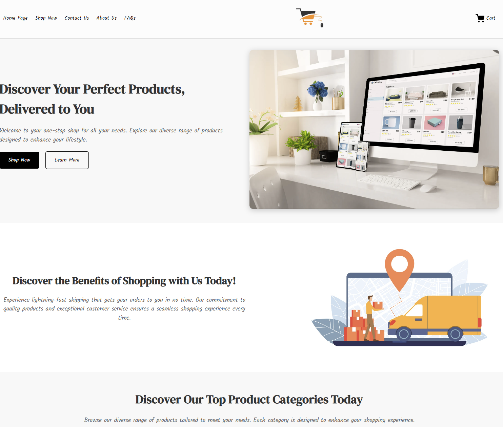
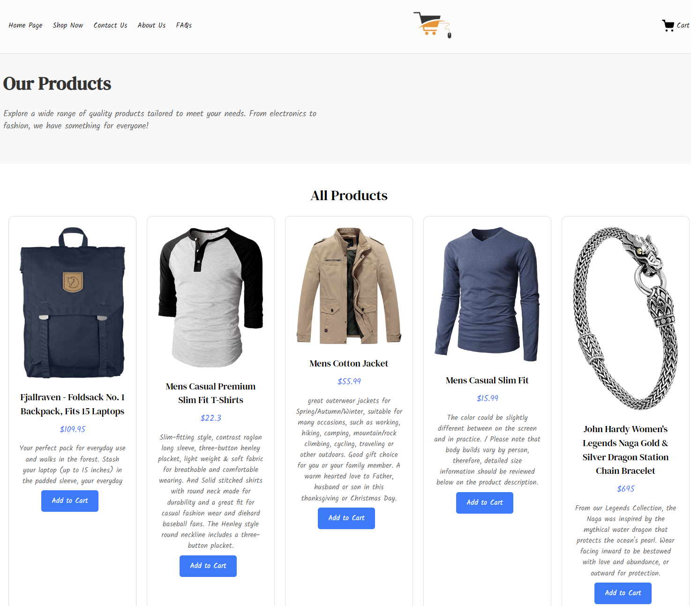

# Proyecto E-commerce

## Overview

**Proyecto-final-ecommerce** is a comprehensive web application developed as part of the **JS24226** course. This project aims to provide a full-featured e-commerce platform where users can browse products, manage their shopping cart, and complete purchases seamlessly.

The application is built using modern web development technologies, ensuring a responsive and user-friendly experience across all devices.

## Technologies Used

- **HTML5**: For structuring the web pages and content.
- **CSS3**: For styling the application and implementing responsive design principles.
- **JavaScript**: For adding interactivity and handling client-side logic.
- **Git**: For version control, enabling collaboration and tracking changes throughout the development process.

## Features

- **Product Browsing**: Users can explore a wide range of products with detailed descriptions and images.
- **Secure Checkout**: A streamlined and secure process for users to complete their purchases.
- **Responsive Design**: Optimized for both mobile and desktop devices to provide a consistent user experience.
- **Contac Form**: using fromspace, have created a working form to contact the owner of the e-commerce site.
- **FAQs Section**: Provides answers to common questions, enhancing user support.

## Project Structure

proyecto-final-ecommerce/ 
├── index.html # Main landing page 
├── shop.html # Shop page listing all products 
├── faqs.html # Frequently Asked Questions page 
├── about.html # About Us page 
├── contact.html # Contact Us page 
│ ├── css/ # Folder for CSS files 
    └── styles.css # Main stylesheet with media queries
│ ├── js/ # Folder for JavaScript files 
    └── scripts.js # Main JavaScript file 
    └── contact-scripts.js #Contact form functionality 
│ ├── assets/ 
│ ├── images/ # Folder for images 
   └── icons/ # Icons for social media, cart, etc.

## Screenshots

### Home Page

### Product Page

### WORK IN PROGRESS

- **CART** - Still in progress, funtions not working
- **Carousell** - Have to remove it as it was not properly working, images where shown erratically.
- **Add to cart buttons** - due Cart is not working, this buttons have no function yet.
- **Responsive nav bar cake button** - I was not able yet to conver the nav bar into a cake button to display the option in a slide dropdown, still working on it.
- **FAQs** - This page locally it takes all the styles, but when deploying on git does not work, still don't know why is this happeining.

- **Media Queries** -  I have add them at the end of the CSS, the same are intended to reduce the grid on mobile and tablet devices for the product section.

### Owner
**Diego Laurora**
Curso Front-End JS 2C2024